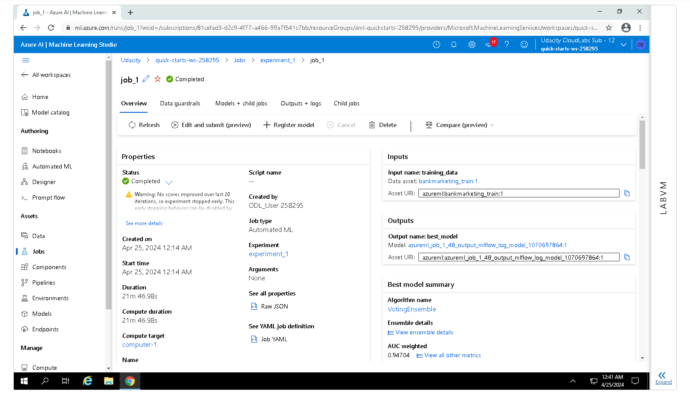
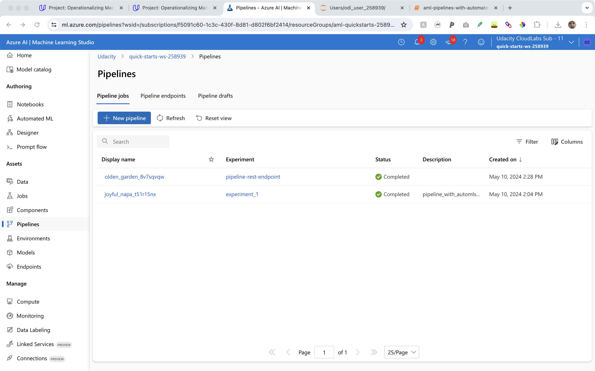

# Operationalizing Machine Learning

This project aims to use Azure to configure a cloud-based machine learning production model, deploy it, and consume it. The project also creates, publishes, and consumes a pipeline. The dataset used is the [bank marketing](https://automlsamplenotebookdata.blob.core.windows.net/automl-sample-notebook-data/bankmarketing_train.csv) data. It is related with direct marketing campaigns of a Portuguese banking institution. The marketing campaigns were based on phone calls. Often, more than one contact to the same client was required, in order to access if the product (bank term deposit) would be ("yes") or not ("no") subscribed. 

## Architectural Diagram

Below is the diagram of the project. Unless otherwise specified, the steps should be manually done in Azure ML Studio.


## Detailed Steps

### 1. Authentication

Skipped because I was using the lab provided by Udacity, where I have restrictions.

### 2. Automated ML Experiment

When creating the AutoML run, we need to upload the data, which we can do either locally or through url. We specify *Tabular* as the data type. We specify *Classification* as the problem type, enable *Explain best model* and use the last column of the data as the target column. For the run, we configure a new computer cluster, in which we select Standard_DS3_v2 for the Virtual Machine Size and select 1 as the minimum number of nodes.

Below shows the run after it is completed. We can see information like the best algorithm, the metric used, the metric value.



Below shows the presence of the uploaded data in data assets. It was uploaded via url of the data.


To get the best model, in the first picture, we click **Models + child jobs**. Rank the models by AUC weighted, our evaluation metric, and select the best model. We can see that in our case, the best model is a voting ensemble model that achieves a high AUC weighted of 0.94704.


### 3. Deploy the best model

In the last picture, click **Deploy**. Enable *Authentication* and use *Azure Container Instance*. It will take a few minutes for the best model to be deployed.

### 4. Enable logging

First, we need to download our config.json file by going to one of the buttons on the top-right corner of the Azure ML studio interface (the one next to settings). The file contains nothing but our specific subscription_id, resource_group and workspace_name. Put it in the same directory of the Udacity-provided Python script logs.py. The script will call the three pieces of information from config.json. Of course, we can input them manually in the script but using config.json will make our life easier. Also, change the name in logs.py to our own endpoint name and make sure the following code is present

```
service.update(enable_app_insights = True)
```

Then, simply running logs.py we will enable Application Insights.


Below is what the endpoint webpage will look like after we run logs.py. Note the **true** label under **Application Insights enabled**. Previously, it was **false**.


It will take a few minutes in the interface to finish enabling Application Insights, after which we will see an uri under **Swagger URI**.

### 5. Swagger Documentation

Following the last step, download the swagger.json file under **Swagger URI**. Save it in the Udacity-provided directory **swagger**. In the same directory there are already serve.py and swagger.sh. Normally, we do not need to change anything as all is well set up. Simply open two separate command windows. In one of them, run

```
bash swagger.sh
```

and in the other, run

```
python serve.py
```

Then, going to localhost in the browser we will see the deployed endpoint but in the form of the more beautiful Swagger UI. We can see what requests we can make to the endpoint, how to form them, and even have a try. Check out the pictures below for details.


### 6. Consume model endpoints

"Consume" is a fancy way to say "use." To use the endpoint, we need to know what kind of input the endpoint is expecting. Since the deployed model is a machine learning model, its input essentially looks like each row in the train or test data. An easy way to get an idea of the input format is to click **Consume** on the endpoint webpage. Alternatively, we can check out the previous Swagger UI website for an example input.

We use the endpoint through script. We can use the Udacity-provided endpoint.py script. Change the scoring_uri and key in the script, which again we can obtain from the endpoint webpage. In endpoint.py, two example inputs are already provided, so running the script will return the endpoint's (or the deployed model's) prediction for the two inputs.

We can see that the endpoint predicts "yes" and "no" respectively for the two inputs.


### 7. Create and publish a pipeline

For this step, we modify and run the Udacity-provided notebook aml-pipelines-with-automated-machine-learning-step.ipynb. Several items need to be updated to our own case, including experiment_name, amlcompute_cluster_name and key (in Data). Below are pictures showing the process and outcomes of this step.

#### Configure a pipeline with the Python SDK


We configure the pipeline in the Jupyter Notebook. This screenshot shows the run details.

#### Create and publish a pipeline



This is the pipeline section of Azure ML studio, showing that the pipeline (the second one in the list) has been created.


This is the pipeline job overview. We can see the bank marketing dataset alongside the AutoML module.

#### Use a REST endpoint to interact with a Pipeline


This shows the list of pipeline endpoints created.


This is the "Published Pipeline overview", showing a REST endpoint and a status of ACTIVE.


This shows the "Completed" status of the pipeline job.

## How to Improve?

1. The target column seems unbalanced. There are more data of a category than of the other. We can employ some latest techniques to address this issue.

2. Enable deep learning.

3. The whole process above may be enclosed into a single pipeline.

## Screencast

Available here: https://www.dropbox.com/scl/fi/n89bbcctpaud00oxl5v4b/GMT20240509-225918_Recording_1512x982.mp4?rlkey=8e3vcdj7grknezus2qg8vl8l3&dl=0. Please do not share.